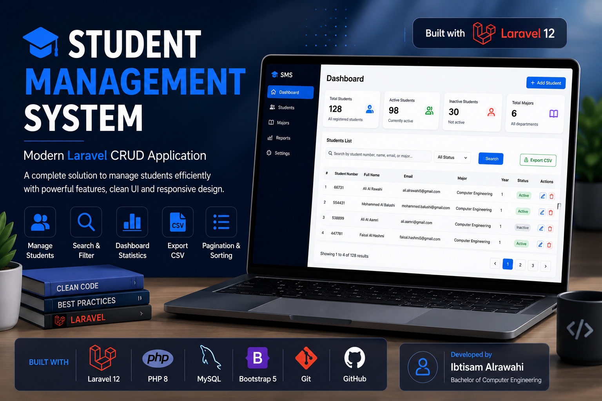
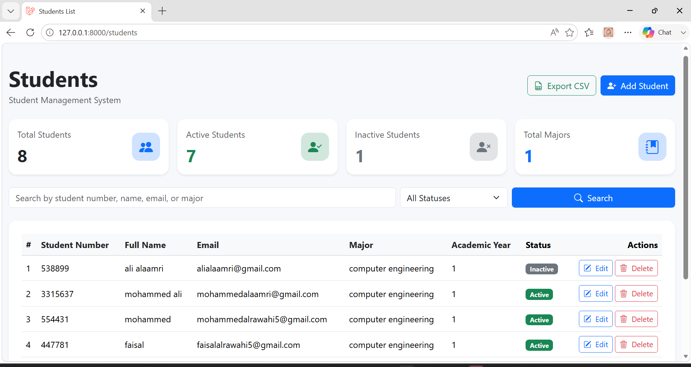
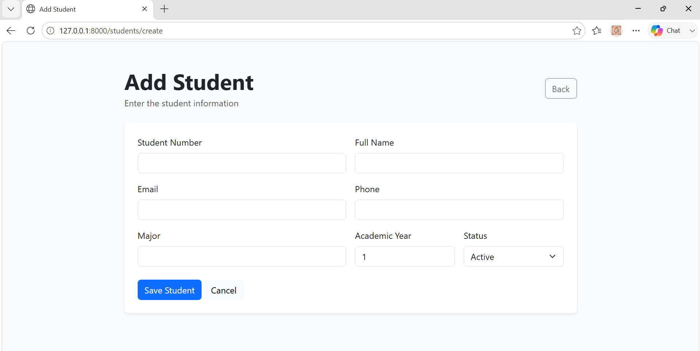
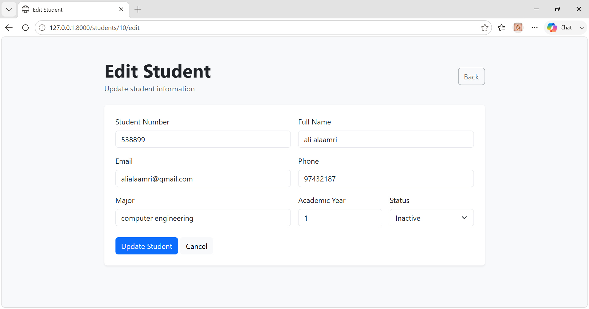
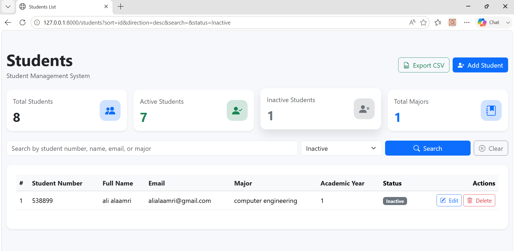
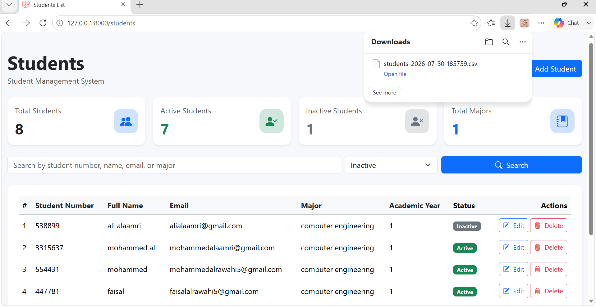

# 🎓 Student Management System

<p align="center">
  
</p>

<p align="center">


</p>

---

# 📖 About

Student Management System is a modern CRUD web application built with **Laravel 12** to simplify student record management.

The application allows administrators to create, update, search, filter, sort, and export student records while providing a clean dashboard with useful statistics.

---

# ✨ Features

- ✅ Create Student
- ✅ Update Student
- ✅ Delete Student
- ✅ Search Students
- ✅ Filter by Status
- ✅ Sort by Student Number
- ✅ Dashboard Statistics
- ✅ Pagination
- ✅ CSV Export
- ✅ Responsive UI

---

# 🛠 Tech Stack

| Technology | Version |
|------------|----------|
| Laravel | 12 |
| PHP | 8.3 |
| Bootstrap | 5 |
| MySQL | 8 |
| Blade | Laravel |
| Eloquent ORM | Laravel |

---

# 📸 Screenshots

## 🏠 Dashboard



---

## ➕ Add Student



---

## ✏️ Edit Student



---

## 🔍 Search & Filter



---

## 📄 CSV Export



---

# 🚀 Installation

```bash
git clone https://github.com/ibtisam5/student-management.git

cd student-management

composer install

cp .env.example .env

php artisan key:generate

php artisan migrate

php artisan serve
```

---

# 📂 Project Structure

```
app/
database/
resources/
routes/
storage/
tests/
```

---

# 👩‍💻 Author

**Ibtisam Al Rawahi**

- Computer Engineering Graduate
- Laravel Developer
- AI Content Creator

GitHub:

https://github.com/ibtisam5

LinkedIn:

https://www.linkedin.com/

---

# ⭐ Support

If you found this project useful, consider giving it a ⭐ on GitHub.
